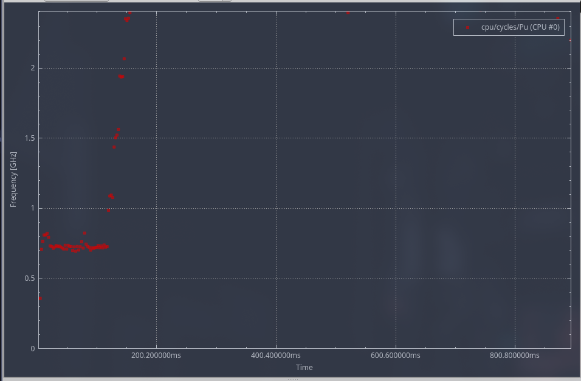
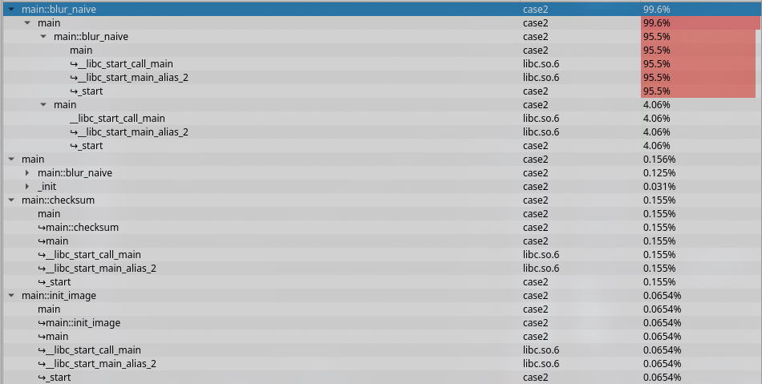
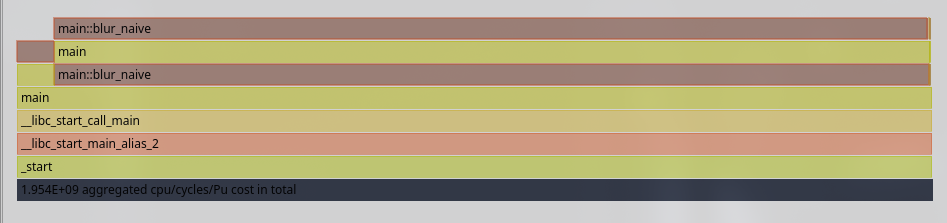
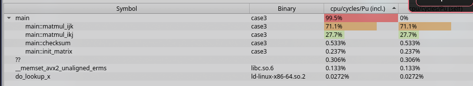
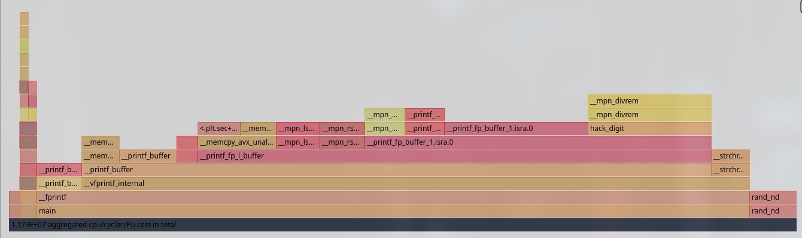
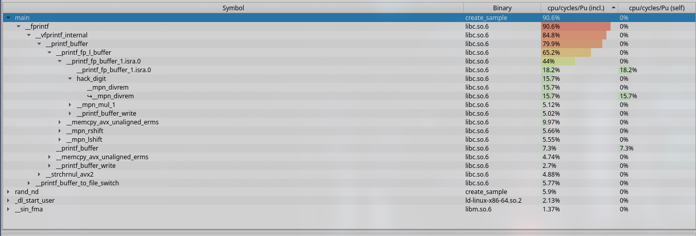
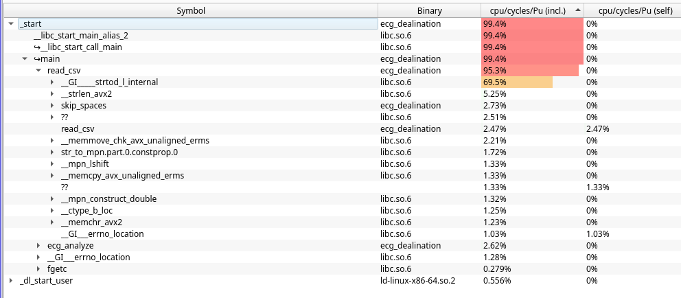
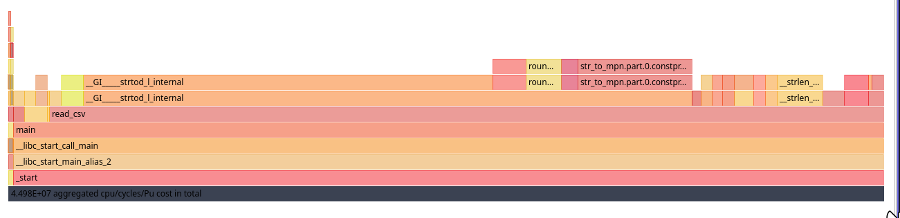

# 5.1 cas 1

Seq sera meilleur car pour rand on va perdre du temps avec l'allocation mémoire et ensuite, on perd encore plus de temps en devant intancier le tableau au préalable

```sh
@nox  perf stat ./case1 seq  
Sequential sum = 990000000, time = 0.006819 s

 Performance counter stats for './case1 seq':

                 0      context-switches:u               #      0.0 cs/sec  cs_per_second     
                 0      cpu-migrations:u                 #      0.0 migrations/sec  migrations_per_second
            58,653      page-faults:u                    # 247225.5 faults/sec  page_faults_per_second
            237.24 msec task-clock:u                     #      0.9 CPUs  CPUs_utilized       
             1,521      branch-misses:u                  #      0.0 %  branch_miss_rate         (49.49%)
        22,750,324      branches:u                       #     95.9 M/sec  branch_frequency     (49.94%)
       128,694,948      cpu-cycles:u                     #      0.5 GHz  cycles_frequency       (50.25%)
       278,654,503      instructions:u                   #      2.2 instructions  insn_per_cycle  (50.51%)

       0.239064305 seconds time elapsed

       0.090227000 seconds user
       0.144294000 seconds sys


@nox  perf stat ./case1 rand
Random     sum = 990000000, time = 0.548644 s

 Performance counter stats for './case1 rand':

                 0      context-switches:u               #      0.0 cs/sec  cs_per_second     
                 0      cpu-migrations:u                 #      0.0 migrations/sec  migrations_per_second
            58,652      page-faults:u                    #  27144.3 faults/sec  page_faults_per_second
          2,160.74 msec task-clock:u                     #      1.0 CPUs  CPUs_utilized       
           650,788      branch-misses:u                  #      0.2 %  branch_miss_rate         (49.96%)
       360,605,774      branches:u                       #    166.9 M/sec  branch_frequency     (49.99%)
     2,424,553,128      cpu-cycles:u                     #      1.1 GHz  cycles_frequency       (50.03%)
     1,694,061,829      instructions:u                   #      0.7 instructions  insn_per_cycle  (50.04%)

       2.165695985 seconds time elapsed

       1.948888000 seconds user
       0.173186000 seconds sys
```

on voit que c'es tà cause des branches de rand qu'on perd bcp de temps

# 5.2 cas 2

```sh
$ perf record -g ./case2
Checksum = 497809409
Time = 0.885842 s
[ perf record: Woken up 1 times to write data ]
[ perf record: Captured and wrote 0.303 MB perf.data (3587 samples) ]      
$ perf report
Samples: 3K of event 'cpu/cycles/Pu', Event count (approx.): 1953722552                       
  Children      Self  Command  Shared Object         Symbol                                   
+   99.99%    99.93%  case2    case2                 [.] main                                 
+   99.99%     0.00%  case2    case2                 [.] _start                               
+   99.99%     0.00%  case2    libc.so.6             [.] __libc_start_main@@GLIBC_2.34        
+   99.99%     0.00%  case2    libc.so.6             [.] __libc_start_call_main               
     0.06%     0.06%  case2    [unknown]             [k] 0xffffffffa1801968                   
     0.03%     0.00%  case2    case2                 [.] free@plt                             
     0.01%     0.01%  case2    ld-linux-x86-64.so.2  [.] do_lookup_x                          
     0.01%     0.00%  case2    ld-linux-x86-64.so.2  [.] _dl_start_user                       
     0.01%     0.00%  case2    ld-linux-x86-64.so.2  [.] _dl_start                            
     0.01%     0.00%  case2    ld-linux-x86-64.so.2  [.] _dl_sysdep_start                     
     0.01%     0.00%  case2    ld-linux-x86-64.so.2  [.] dl_main                              
     0.01%     0.00%  case2    ld-linux-x86-64.so.2  [.] _dl_relocate_object                  
     0.01%     0.00%  case2    ld-linux-x86-64.so.2  [.] _dl_relocate_object_no_relro         
     0.01%     0.00%  case2    ld-linux-x86-64.so.2  [.] _dl_lookup_symbol_x    
```






# 5.3 Case 3
```sh
$ perf stat ./case3              
ijk checksum = 4417572705.671469, time = 0.220391 s
ikj checksum = 4417572705.671469, time = 0.052471 s

 Performance counter stats for './case3':

                 0      context-switches:u               #      0.0 cs/sec  cs_per_second     
                 0      cpu-migrations:u                 #      0.0 migrations/sec  migrations_per_second
             1,597      page-faults:u                    #   5762.9 faults/sec  page_faults_per_second
            277.12 msec task-clock:u                     #      0.9 CPUs  CPUs_utilized       
           342,736      branch-misses:u                  #      0.5 %  branch_miss_rate         (49.97%)
        67,473,421      branches:u                       #    243.5 M/sec  branch_frequency     (50.31%)
       464,812,645      cpu-cycles:u                     #      1.7 GHz  cycles_frequency       (50.34%)
       434,417,774      instructions:u                   #      0.9 instructions  insn_per_cycle  (50.03%)

       0.285063051 seconds time elapsed

       0.266727000 seconds user
       0.005880000 seconds sys
```



# 5.4 Case 4

```sh
$ perf record -g ./case4                                            
Result = 267914296
Time = 0.895551 s
[ perf record: Woken up 1 times to write data ]
[ perf record: Captured and wrote 0.221 MB perf.data (3600 samples) ]

$ perf report
 Samples: 3K of event 'cpu/cycles/Pu', Event count (approx.): 1980186465                       
  Children      Self  Command  Shared Object         Symbol                                   
+   99.99%    99.98%  case4    case4                 [.] fib_recursive                        
     0.01%     0.01%  case4    [unknown]             [k] 0xffffffffa1801968                   
     0.01%     0.01%  case4    ld-linux-x86-64.so.2  [.] _dl_relocate_object_no_relro         
     0.01%     0.00%  case4    ld-linux-x86-64.so.2  [.] _dl_start_user                       
     0.01%     0.00%  case4    ld-linux-x86-64.so.2  [.] _dl_start                            
     0.01%     0.00%  case4    ld-linux-x86-64.so.2  [.] _dl_sysdep_start                     
     0.01%     0.00%  case4    ld-linux-x86-64.so.2  [.] dl_main                              
     0.01%     0.00%  case4    ld-linux-x86-64.so.2  [.] _dl_relocate_object                  
                                                                                 
```

# 5.6 Prise en main

Après compilation, j'ai bel et bien le fichier `build/create_sample` mais je n'ai pas le fichier `build/application`. Après vérification du CMakeList.txt, `application` n'est pas présent dans les fichiers résultants, j'ai donc fait sans.

```sh
$ perf stat ./create_sample 10000                                
Created 10000 measurements in 3.949000 ms

 Performance counter stats for './create_sample 10000':

                 0      context-switches:u               #      0.0 cs/sec  cs_per_second     
                 0      cpu-migrations:u                 #      0.0 migrations/sec  migrations_per_second
                75      page-faults:u                    #  17101.6 faults/sec  page_faults_per_second
              4.39 msec task-clock:u                     #      0.3 CPUs  CPUs_utilized       
            42,758      branch-misses:u                  #      1.4 %  branch_miss_rate         (31.64%)
         3,786,914      branches:u                       #    863.5 M/sec  branch_frequency     (44.57%)
        11,661,539      cpu-cycles:u                     #      2.7 GHz  cycles_frequency       (67.37%)
        25,236,013      instructions:u                   #      1.9 instructions  insn_per_cycle  (68.36%)

       0.005032272 seconds time elapsed

       0.004015000 seconds user
       0.001012000 seconds sysct 
$ perf record -g ./create_sample 10000                           
Created 10000 measurements in 4.285000 ms
[ perf record: Woken up 1 times to write data ]
[ perf record: Captured and wrote 0.004 MB perf.data (25 samples) ]
$ perf report
Samples: 25  of event 'cpu/cycles/Pu', Event count (approx.): 11731755                        
  Children      Self  Command        Shared Object         Symbol                             
+   90.59%     0.00%  create_sample  create_sample         [.] main                           
+   90.59%     0.00%  create_sample  libc.so.6             [.] fprintf                        
+   84.82%     0.00%  create_sample  libc.so.6             [.] __vfprintf_internal            
+   79.94%     7.30%  create_sample  libc.so.6             [.] __printf_buffer                
+   65.20%     0.00%  create_sample  libc.so.6             [.] __printf_fp_l_buffer           
+   44.02%    18.22%  create_sample  libc.so.6             [.] __printf_fp_buffer_1.isra.0    
+   15.66%    15.66%  create_sample  libc.so.6             [.] __mpn_divrem                   
+   15.66%     0.00%  create_sample  libc.so.6             [.] hack_digit                     
+   14.71%     9.30%  create_sample  libc.so.6             [.] __memmove_avx_unaligned_erms   
+    7.72%     7.72%  create_sample  libc.so.6             [.] __printf_buffer_write          
+    5.90%     5.90%  create_sample  create_sample         [.] rand_nd                        
+    5.77%     5.77%  create_sample  libc.so.6             [.] __printf_buffer_to_file_init   
+    5.77%     0.00%  create_sample  libc.so.6             [.] __printf_buffer_to_file_switch 
+    5.66%     5.66%  create_sample  libc.so.6             [.] __mpn_rshift                   
+    5.55%     5.55%  create_sample  libc.so.6             [.] __mpn_lshift                   
+    5.41%     5.41%  create_sample  libc.so.6             [.] memcpy@@GLIBC_2.14@plt         
+    5.12%     5.12%  create_sample  libc.so.6             [.] __mpn_mul_1                    
+    4.88%     4.88%  create_sample  libc.so.6             [.] __strchrnul_avx2               
+    2.13%     0.00%  create_sample  ld-linux-x86-64.so.2  [.] _dl_start_user                 
+    2.13%     0.00%  create_sample  ld-linux-x86-64.so.2  [.] _dl_start                      
+    2.13%     0.00%  create_sample  ld-linux-x86-64.so.2  [.] _dl_sysdep_start               
+    2.13%     0.00%  create_sample  ld-linux-x86-64.so.2  [.] dl_main                        
+    1.37%     1.37%  create_sample  libm.so.6             [.] __sin_fma                      
+    1.07%     1.07%  create_sample  ld-linux-x86-64.so.2  [.] rtld_mutex_dummy               
+    1.07%     1.07%  create_sample  [unknown]             [k] 0xffffffffa1801968             
+    1.07%     0.00%  create_sample  ld-linux-x86-64.so.2  [.] _dl_map_object_deps            
+    1.07%     0.00%  create_sample  ld-linux-x86-64.so.2  [.] _dl_catch_exception            
+    1.07%     0.00%  create_sample  ld-linux-x86-64.so.2  [.] openaux                        
+    1.07%     0.00%  create_sample  ld-linux-x86-64.so.2  [.] _dl_map_new_object             
+    1.07%     0.00%  create_sample  ld-linux-x86-64.so.2  [.] _dl_map_object_from_fd         
+    1.07%     0.00%  create_sample  ld-linux-x86-64.so.2  [.] _dl_relocate_object            
+    1.07%     0.00%  create_sample  libc.so.6             [.] __wmemchr_ifunc

```




# 5.7 Profiling
```sh
 @nox  perf stat ./ecg_dealination ../80bpm0.csv ../out_lab06.csv
CSV chargé avec 12 leads et 7500 échantillons.
[ecg_analyze] threshold auto = 0.610762 (max=1.745033)
[ecg_analyze] 22 pics R détectés, 21 RR calculés
22 pics R détectés.
[ecg_destroy] Contexte free
Analyse terminée. Résultats sauvegardés dans ../out_lab06.csv

 Performance counter stats for './ecg_dealination ../80bpm0.csv ../out_lab06.csv':

                 0      context-switches:u               #      0.0 cs/sec  cs_per_second     
                 0      cpu-migrations:u                 #      0.0 migrations/sec  migrations_per_second
               341      page-faults:u                    #  23764.8 faults/sec  page_faults_per_second
             14.35 msec task-clock:u                     #      0.4 CPUs  CPUs_utilized       
           170,614      branch-misses:u                  #      0.8 %  branch_miss_rate         (42.85%)
        19,464,301      branches:u                       #   1356.5 M/sec  branch_frequency     (52.43%)
        39,436,340      cpu-cycles:u                     #      2.7 GHz  cycles_frequency       (58.19%)
        94,802,075      instructions:u                   #      2.4 instructions  insn_per_cycle  (57.15%)

       0.022179175 seconds time elapsed

       0.012552000 seconds user
       0.002877000 seconds sys
$ perf record -g ./ecg_dealination ../80bpm0.csv ../out_lab06.csv
CSV chargé avec 12 leads et 7500 échantillons.
[ecg_analyze] threshold auto = 0.610762 (max=1.745033)
[ecg_analyze] 22 pics R détectés, 21 RR calculés
22 pics R détectés.
[ecg_destroy] Contexte free
Analyse terminée. Résultats sauvegardés dans ../out_lab06.csv
[ perf record: Woken up 1 times to write data ]
[ perf record: Captured and wrote 0.010 MB perf.data (84 samples) ]
$ perf report
Samples: 84  of event 'cpu/cycles/Pu', Event count (approx.): 44979092                        
  Children      Self  Command          Shared Object         Symbol                           
+   99.44%     0.00%  ecg_dealination  ecg_dealination       [.] _start                       
+   99.44%     0.00%  ecg_dealination  libc.so.6             [.] __libc_start_main@@GLIBC_2.34
+   99.44%     0.00%  ecg_dealination  libc.so.6             [.] __libc_start_call_main       
+   99.44%     0.00%  ecg_dealination  ecg_dealination       [.] main                         
+   95.26%     2.47%  ecg_dealination  ecg_dealination       [.] read_csv                     
+   69.95%    47.18%  ecg_dealination  libc.so.6             [.] __GI_____strtod_l_internal   
+   14.78%    14.38%  ecg_dealination  libc.so.6             [.] str_to_mpn.part.0.constprop.0
+    5.25%     5.25%  ecg_dealination  libc.so.6             [.] __strlen_avx2                
+    3.96%     3.96%  ecg_dealination  libc.so.6             [.] round_and_return             
+    3.85%     3.85%  ecg_dealination  libc.so.6             [.] __mpn_mul                    
+    2.73%     2.73%  ecg_dealination  ecg_dealination       [.] skip_spaces                  
+    2.62%     1.29%  ecg_dealination  ecg_dealination       [.] ecg_analyze                  
+    2.51%     2.51%  ecg_dealination  libc.so.6             [.] 0x0000000000146e9f           
+    2.51%     0.00%  ecg_dealination  libc.so.6             [.] 0x00007faf6228feaa           
+    2.31%     1.03%  ecg_dealination  libc.so.6             [.] __errno_location             
+    2.21%     2.21%  ecg_dealination  libc.so.6             [.] __memcpy_chk@plt             
+    2.21%     0.00%  ecg_dealination  libc.so.6             [.] __memmove_chk_avx_unaligned_e
+    1.91%     1.91%  ecg_dealination  libc.so.6             [.] round_away                   
+    1.33%     1.33%  ecg_dealination  ecg_dealination       [.] ecg_highpass_ma              
+    1.33%     1.33%  ecg_dealination  libc.so.6             [.] __mpn_lshift                 
+    1.33%     1.33%  ecg_dealination  libc.so.6             [.] __memmove_avx_unaligned_erms 
+    1.33%     1.33%  ecg_dealination  [unknown]             [k] 0xffffffffa1801968           
+    1.32%     1.32%  ecg_dealination  libc.so.6             [.] __mpn_construct_double       
+    1.28%     1.28%  ecg_dealination  ecg_dealination       [.] __errno_location@plt         
+    1.25%     1.25%  ecg_dealination  ecg_dealination       [.] __ctype_b_loc@plt            
+    1.25%     0.00%  ecg_dealination  libc.so.6             [.] __ctype_b_loc                
+    1.23%     1.23%  ecg_dealination  libc.so.6             [.] __memchr_avx2                
+    0.56%     0.00%  ecg_dealination  ld-linux-x86-64.so.2  [.] _dl_start_user               
+    0.56%     0.00%  ecg_dealination  ld-linux-x86-64.so.2  [.] _dl_start                    
+    0.56%     0.00%  ecg_dealination  ld-linux-x86-64.so.2  [.] _dl_sysdep_start             
+    0.56%     0.00%  ecg_dealination  ld-linux-x86-64.so.2  [.] dl_main                      
     0.28%     0.28%  ecg_dealination  libc.so.6             [.] _IO_getc                     
     0.28%     0.28%  ecg_dealination  ld-linux-x86-64.so.2  [.] strncmp                      
     0.28%     0.28%  ecg_dealination  ld-linux-x86-64.so.2  [.] __x86_cpu_features_ifunc     
     0.28%     0.00%  ecg_dealination  ld-linux-x86-64.so.2  [.] _dl_receive_error            
     0.28%     0.00%  ecg_dealination  ld-linux-x86-64.so.2  [.] version_check_doit           
     0.28%     0.00%  ecg_dealination  ld-linux-x86-64.so.2  [.] _dl_check_all_versions       

$ hotspot perf.data
```


